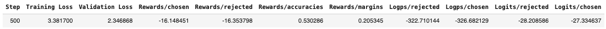
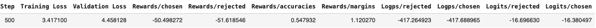
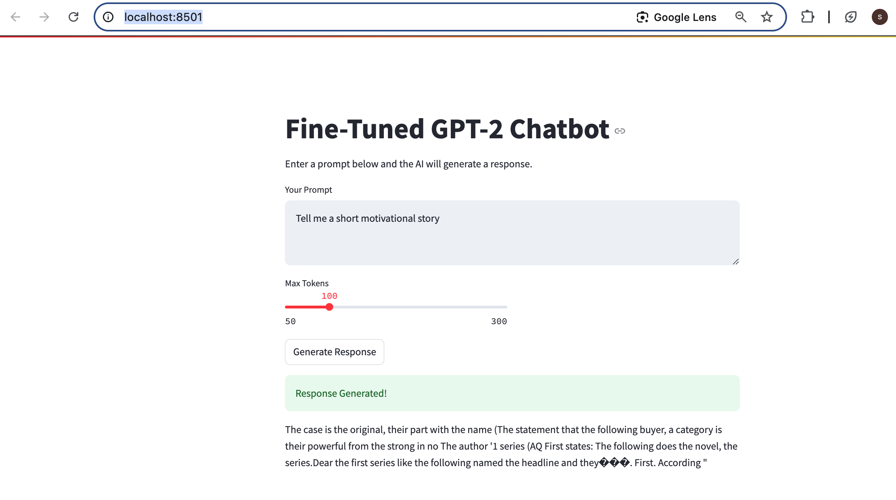

# Direct Preference Optimization (DPO) for GPT-2 Fine-Tuning

[View Model on Hugging Face](https://huggingface.co/SHN157/dpo-model)

## Table of Contents
- [Project Overview](#project-overview)
- [Dataset](#dataset)
- [Model Details](#model-details)
- [Training & Evaluation Results](#training--evaluation-results)
- [Model Deployment](#model-deployment)
- [Web Application](#web-application)
- [Sample Web App Testing](#sample-web-app-testing)
- [Conclusion](#conclusion)

---

## Student Information
- **Name**: Soe Htet Naing  
- **ID**: st125166  

---

## Project Overview
This project fine-tunes GPT-2 using **Direct Preference Optimization (DPO)** to align the model's responses with user preferences. The training utilizes **UltraFeedback**, a dataset containing human feedback on model-generated responses.

---

## Dataset
- **Source**: [UltraFeedback Dataset](https://huggingface.co/datasets/openbmb/UltraFeedback)
- **Dataset Used**: `argilla/ultrafeedback-binarized-preferences-cleaned`
- **Structure**:
  - **Train size**: 48,733 samples
  - **Test size**: 12,184 samples
  - **Features**:
    - `prompt`: The user input or context
    - `chosen`: Preferred model response
    - `rejected`: Non-preferred model response

---

## Model Details
- **Pretrained Model**: `GPT-2`
- **Training Configuration**:
  - **Device**: CUDA (GPU)
  - **Optimizers Tested**: AdamW, RMSprop
  - **Batch Sizes**: 4, 8
  - **Learning Rates**: `5e-4`, `1e-3`, `2e-3`
  - **Beta Values**: `0.1`, `0.2`, `0.3`
  - **Training Steps**: 500
  - **Evaluation Strategy**: Every 500 steps

---

## Training & Evaluation Results
Performance results of 3 different training configurations are shown below.


*Figure 1: Training results for configuration 1.*


*Figure 2: Training results for configuration 2.*


*Figure 3: Training results for configuration 3.*

- **Best Model Configuration**:
  - **Learning Rate**: `0.002`
  - **Batch Size**: `8`
  - **Optimizer**: AdamW
  - **Beta**: `0.3`
  - **Training Steps**: `500`

---

## Model Deployment
The fine-tuned model is available on **Hugging Face**:

```python
from transformers import AutoModelForCausalLM, AutoTokenizer
repo_name = "SHN157/dpo-model"
model = AutoModelForCausalLM.from_pretrained(repo_name)
tokenizer = AutoTokenizer.from_pretrained("gpt2")
if tokenizer.pad_token is None:
    tokenizer.pad_token = tokenizer.eos_token
print("✅ Model successfully loaded from Hugging Face.")
```

---

## Web Application
The Streamlit web application allows real-time interaction with the fine-tuned model.

### How to Run
```bash
pip install streamlit transformers torch
streamlit run app.py
```
Open [http://localhost:8501/](http://localhost:8501/) in your browser.

---

## Sample Web App Testing
Below is a screenshot from the testing phase of the web application.


*Figure 4: Sample test of the web application.*

---

## Conclusion
This project successfully fine-tuned **GPT-2** using Direct Preference Optimization (DPO). The fine-tuned model aligns better with user preferences, and the **Streamlit web app** enables real-time interaction with the chatbot.
